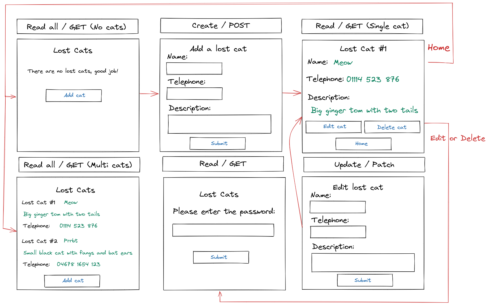

# {{PROBLEM}} Web Design Recipe (Level Three)

## 1. Describe the Problem

## Stage One
> As a user
* So that I can find my cat that I lost
* I want to post an advert for a lost cat with some description of the cat, and my telephone number so people can contact me

> As a user
* So that I can help others find their lost cats
* I want to see all of the lost cat adverts

## Stage Two
> As a user
* So that I can focus on the yet not-found cats
* I want to delete adverts for cats that have been found

> As a user
* So that I can update lost cat adverts with potential sightings
* I want to update adverts

## Stage Three (More Challenging)
> As a user
* So that I can protect my cat adverts from weird people
* I want to give a password with each advert, and only people who give the right password can update or delete that advert

## 2. Design the Interface

_This is the fun part! Use excalidraw.com or a similar tool to design some
wireframes (rough sketches of the user interface). Include interactions and
transitions between pages — those are the most critical part._



## 3. Design the Database

_Design the data tables that will store all of the information your application
manages. Include the data types and examples of three rows. Consider use Google
Sheets or [AsciiTable](https://ozh.github.io/ascii-tables/) to do this._

```plain
# Example

Table name: cats_table

| id SERIAL PK | name TEXT |  phone TEXT   | description TEXT  | password TEXT |
|------------------|-----------|---------------|-------------------|---------------|
|                1 | Bob       |    012468 235 | A small green cat | catpass       |
|                2 | Scraggy   | 098946 468484 | A street cat      | passcat       |

```

## 4. Create Examples of User Interactions

_Create examples of user interactions and expectations._

```ruby
# As you learn the testing tools you might start writing with realistic test
# code here, but at the start it's OK if it's just English or made up code.

# View no entries
visit "/lostcats"
# User sees: You have no diary entries.

# Add an entry
visit "/lostcats"
click link "Add a lost kitty"
enter "Barry the cat" into "Name" field
enter "05128 852 298" into "Phone" field
enter "A tortoiseshell tom" into "Description" field
enter "oaushdoauhd" into "password" field
click button "Submit"
# User sees the advert on the board

# Multiple entries
visit "/lostcats"
click link "Add a lost kitty"
enter "Barry the cat" into "Name" field
enter "05128 852 298" into "Phone" field
enter "A tortoiseshell tom" into "Description" field
enter "oaushdoauhd" into "password" field
click button "Submit"
click link "Add a lost kitty"
enter "Mouse" into "Name" field
enter "20934 234 269" into "Phone" field
enter "A large grey cat" into "Description" field
enter "987a4uhto2" into "password" field
click button "Submit"
# User sees both cats in the diary list:

```

## 6. Test-Drive the Behaviour

_Follow this cycle:_

1. Add a feature test in `/spec/feature/` (RED)
2. Implement the behaviour in `app.rb`
3. Does it pass without data model changes? (GREEN) Then skip to step 6.
4. Otherwise, add a unit test for the data model to `/spec/unit` (RED)
5. Implement the behaviour in your data model class. (GREEN)
6. Apply any refactors to improve the structure of the code. (REFACTOR)  
   Run `rubocop` as part of this.
7. Go back to step 1.


<!-- BEGIN GENERATED SECTION DO NOT EDIT -->

---

**How was this resource?**  
[😫](https://airtable.com/shrUJ3t7KLMqVRFKR?prefill_Repository=makersacademy/web-starter-level-three&prefill_File=recipe/recipe.md&prefill_Sentiment=😫) [😕](https://airtable.com/shrUJ3t7KLMqVRFKR?prefill_Repository=makersacademy/web-starter-level-three&prefill_File=recipe/recipe.md&prefill_Sentiment=😕) [😐](https://airtable.com/shrUJ3t7KLMqVRFKR?prefill_Repository=makersacademy/web-starter-level-three&prefill_File=recipe/recipe.md&prefill_Sentiment=😐) [🙂](https://airtable.com/shrUJ3t7KLMqVRFKR?prefill_Repository=makersacademy/web-starter-level-three&prefill_File=recipe/recipe.md&prefill_Sentiment=🙂) [😀](https://airtable.com/shrUJ3t7KLMqVRFKR?prefill_Repository=makersacademy/web-starter-level-three&prefill_File=recipe/recipe.md&prefill_Sentiment=😀)  
Click an emoji to tell us.

<!-- END GENERATED SECTION DO NOT EDIT -->
